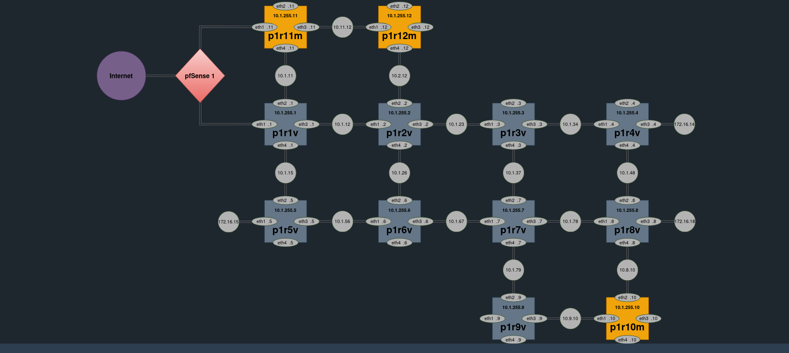
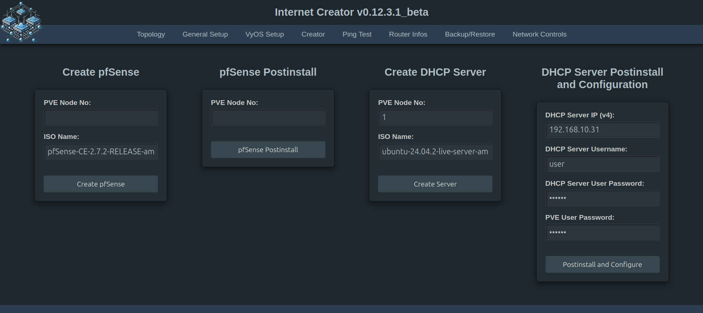
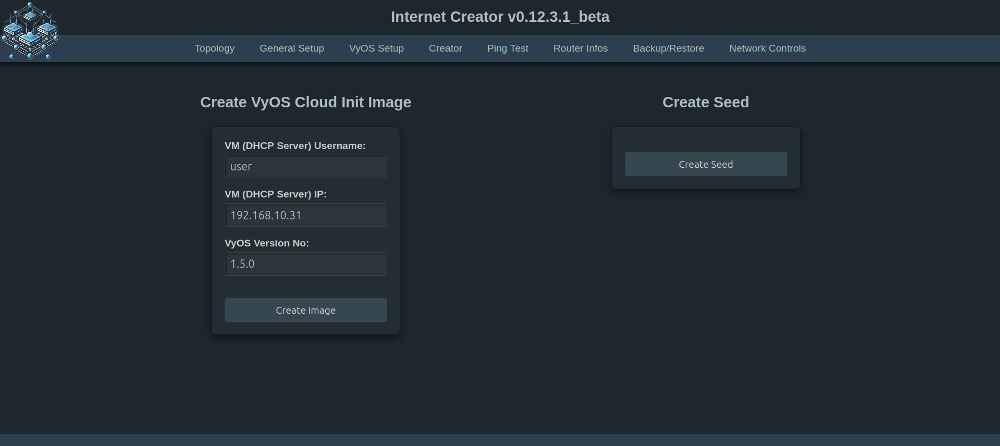
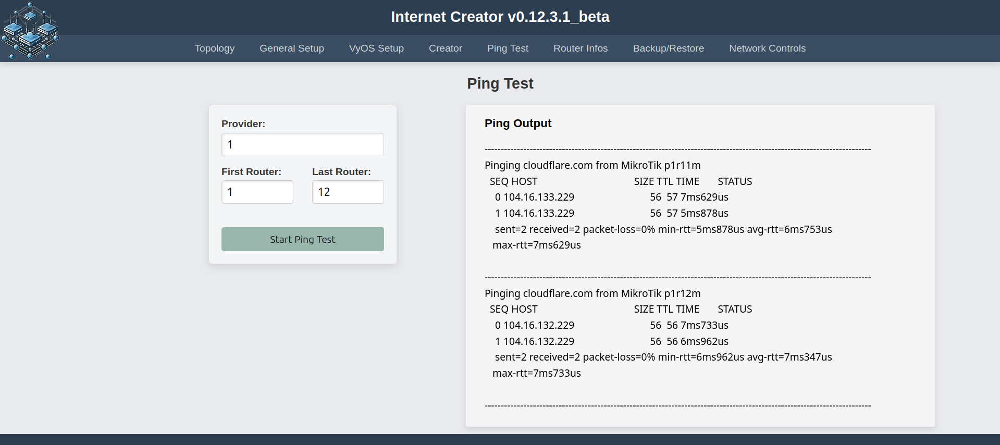

## Verwendungszwecke:

Es geht hier darum, drei Netzwerke (ISPs) bestehend aus jeweils 9 VyOS-Routern automatisiert unter PVE aufzusetzen und mit Ansible zu konfigurieren. ISP1 besteht zusätzlich aus 3 MikroTik Routern, die (zumindest vorläufig) über SSH konfiguriert werden. Der Internet Creator (INC) ist ein Ableger von [aibix' awesome setup (for) ISP learning](https://github.com/aibix0001/aasil), der u.a. darauf ausgelegt ist, sich bzgl. der Arbeitsgeschwindigkeit an die Gegebenheiten verschieden starker CPUs anzupassen: So gibt es einen Fast Modus für Rechner mit besonders starken CPUs, einen Normalmodus für schwächere CPUs und einen seriellen Modus für besonders schwache CPUs. Um den passenden Modus für die jeweils verwendete CPU zu finden, siehe den Abschnitt 'Erfahrungswerte' in der 'Beschreibung und Gebrauchshinweise zum INC v0.12.3.1_beta.md'.
Das [Aibix-Projekt](https://www.twitch.tv/aibix0001) wendet sich u.a. an Auszubildende und Studenten im IT-Bereich, sowie weitere Interessierte, die nicht unbedingt immer drei Kraftpakete zur Verfügung haben. Der Internet Creator ist deshalb insbesondere auch zur Verwendung mit schwächeren Rechnern entwickelt worden.

## Setup:
Bitte den Anweisungen unter 'Setup INC v0.12.3.1_beta.md' folgen.








Ggf. Dark Reader ausschalten!

## Neue Features des INC v0.12.1_beta

1. Der INC v0.12.1_beta ist jetzt nicht mehr nur für Btrfs- und ZFS-Dateisysteme ausgelegt, sondern auch für Ext4.
2. Einbindung von 3 MikroTik Routern in ISP1.
3. Die Teilautomatisierung des Setup's ist insoweit weiterentwickelt, dass die Skripte zur Erstellung und Postinstallation der pfSense von der GUI aus automatisch aufgerufen werden können, wobei die Installation und Konfiguration der pfSense weiterhin händisch erfolgen muss. Außerdem können auch die Skripte zur Erstellung, Postinstallation und Konfiguration des DHCP-Servers von der GUI aus aufgerufen werden. Die Installation des DHCP Servers muss weiterhin händisch vorgenommen werden.
4. Die VLAN-Tags werden jetzt über Hash-Tables vergeben, was den erheblichen Vorteil hat, dass sie sehr leicht veränderbar sind.
5. Die 'standalone' Upgrade-Funktion außerhalb der Neuerstellung von Routern ist aus bislang ungeklärten Gründen zumindest vorläufig depracted.

## Neue Features des INC v0.12.2.1_beta

Die Erstellung des VyOS Cloud Init Images, wie es auf der Seite [VyOS cloud-init](https://docs.vyos.io/en/latest/automation/cloud-init.html) unter _Cloud-init on Proxmox_ beschrieben wird, funktioniert nicht mehr ohne weiteres, weil die vyos.iso Dateien neuerdings kein ```md5sum.txt```mehr enthalten und man stattdessen ```sha256``` verwenden muss. Bei der händischen Erstellung eines VyOS Cloud Init Images muss man deshalb in ```vyos-vm-images/roles/mount-iso/tasks/main.yml``` Zeile 12 folgendermaßen ändern:

```command: md5sum -c md5sum.txt```

ersetzen durch:

```command: sha256sum -c sha256sum.txt```

Abgesehen von einigen Detailänderungen in diversen Skripten, besteht die wesentliche Änderung in der Version INC v0.12.2.1_beta gegenüber der Version INC v0.12.1_beta darin, diesen Bug zu fixen.

## Neue Features des INC v0.12.3.1_beta

Bei der Erstellung von VyOS Routern kann nun zwischen dem Release Typ ```Stream```- stabil, aber nur vierteljährlich aktualisiert - und ```Rolling```- brandaktuell, aber möglicherweise (in relativ seltenen Ausnahmefällen) etwas instabil - gewählt werden.

## Spezielle Probleme der Version v0.12.3.1_beta

Statt auf einem Development-Server läuft die Web App auf einem professionellen Gunicorn Server. Obwohl das Frontend weitestgehend unauffällig läuft, gibt es im Backend regelmäßig Fehlermeldungen, die bislang nicht abgestellt werden konnten. Diese Fehlermeldungen treten aber nur im Zusammenhang mit der Verwendung des flask-socketio beim Ping-Test und der Anzeige von Routerinformationen auf und sind offenbar darauf zurückzuführen, dass sich der Gunicorn-Server bzw. das Eventlet-Modul mit dem socketio nicht ganz verträgt. Zu Einzelheiten siehe 'Spezielle Probleme des INC on Gunicorn.md'.

Achtung: Sobald man ```pip install gunicorn eventlet``` in der ```.venv``` ausgeführt hat, wird der Ping Test und die Ausgabe der Router Infos unter Version v0.12.3 in dieser ```.venv``` nicht mehr funktionieren. Man braucht dann vorher:

```bash
pip uninstall gunicorn eventlet
```

## Troubleshooting

Wenn bei der Ausführung irgendeiner Funktion Fehler auftreten, hilft es in der Regel, einen anderen Mode zu wählen und/oder weniger Router in einem Durchgang zu erstellen.

Sollte der (seltene) Fall eintreten, dass obwohl alles korrekt aussieht - die Configs der Router sind ok, es gibt ein DHCP-Lease von der pfSense und die VLAN-Tags des LAN Netzes stimmen auch (also 1011, 2011 bzw. 3011) - es aber trotzdem nicht möglich ist, raus zu pingen, dann alle Router und die pfSense restarten. Wenn es dann immer noch nicht geht, mit anderem (meistens höherem) Delay-Wert oder ggf. im Fast Modus nochmal neu erzeugen. Es kann sein, dass dieses Problem etwas häufiger auftritt, wenn eine pfSense verwendet wird, die aus einem Restore eines Backups erstellt worden ist. In diesem Fall erstmal nur die pfSense neustarten, wenn das nicht reicht, sie erneut restoren und ansonsten händisch aufsetzen. Dieses letztgenannte Phänomen ist aber noch nicht genügend getestet, um zuverlässige Aussagen darüber machen zu können.
